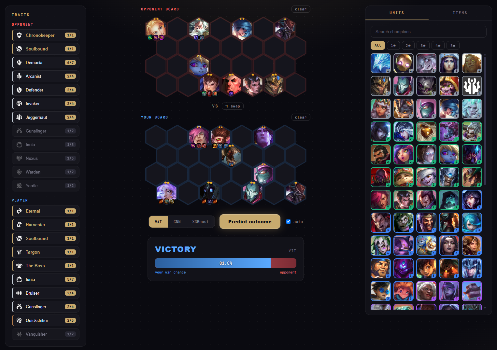

# TFT Round Prediction

A machine learning project designed to predict the outcomes of combat rounds in Teamfight Tactics (TFT). This repository contains the full pipeline for raw data processing, feature engineering, and model training. It evaluates multiple machine learning architectures, ranging from a baseline tree-based model (XGBoost) to deep learning models (Convolutional Neural Networks and Vision Transformers). The models process comprehensive game states, including unit placements, item distributions, and active traits.

## Project structure

The code is split into three clearly separated concerns:

```
src/
├── training/     # Model training (pre-existing): feature extraction, datasets,
│   ├── baseline/ #   models and trainers for the XGBoost / CNN / ViT pipelines.
│   ├── cnn/
│   ├── vit/
│   └── utils/    #   static data + vocabularies shared by the extractors.
├── api/          # Inference backend (FastAPI): featurize a board and predict.
│   ├── config.py, schema.py, featurize.py, predictor.py, app.py, fetch_assets.py
├── web/          # Frontend: the board-builder single-page app + downloaded icons.
│   └── index.html, style.css, app.js, assets/, catalog.json, data/
└── cli.py        # `trp` command-line entrypoint for every stage.
```

`api` depends on `training` (it reuses the exact feature transforms) and serves
`web`; `training` has no knowledge of the API or frontend.

## Setup

This project uses uv for dependency management.

1. Install dependencies:
   ```bash
   uv sync
   ```
2. Activate the virtual environment:
   ```bash
   # On Windows
   .venv\Scripts\activate

   # On macOS/Linux
   source .venv/bin/activate
   ```

## Training

All code under `src/training`. Each model follows the same two-step pattern:
extract features from the raw parquet into a feature directory, then train and
evaluate on a chronological (oldest → train, newest → test) split.

### Baseline (XGBoost)

Takes the list of units, traits and the total board cost as input.

```bash
# Extract features
trp extract-baseline-features --raw-path path/to/raw/data --feature-path path/to/features

# Train & evaluate (optionally save the model for the app with -m)
trp train-baseline --feature-path path/to/features -m models/baseline/xgboost.json
```

### CNN

Takes unit and item placement and traits as input.

```bash
# Extract features
trp extract-cnn-features --raw-path path/to/raw/data --feature-path path/to/features

# Train & evaluate
trp train-cnn --feature-path path/to/features --batch-size 512 --model-kw dropout=0.2

# Hyperparameter optimization
trp hpo-cnn --feature-path path/to/features --n-trials 50
```

### ViT

Takes unit and item placement and traits as input.

```bash
# Extract features
trp extract-vit-features --raw-path path/to/raw/data --feature-path path/to/features

# Train & evaluate
trp train-vit --feature-path path/to/features --batch-size 512 --model-kw dropout=0.2

# Hyperparameter optimization
trp hpo-vit --feature-path path/to/features --n-trials 50
```

### Results

Comparison of the different models evaluated on the test set.

| Model | Accuracy |
| :--- | :---: |
| **XGBoost** | 73.0% |
| **CNN** | 79.1% |
| **ViT** | 80.4% |

## App

An interactive board builder (`src/web`) backed by a FastAPI inference service
(`src/api`). You build a matchup (units, items and star levels for both sides)
and get the predicted win probability from any trained model. Board encoding
reuses the exact training feature transforms, so a board built in the UI is
featurized identically to the data the models were trained on.



### 1. Save a model

- **XGBoost** `train-baseline` saves the fitted model and its feature order:

  ```bash
  trp train-baseline -f data/set16/feature/baseline/set16.parquet -m models/baseline/xgboost.json
  ```

- **CNN / ViT** use any Lightning `.ckpt` produced by `train-cnn` / `train-vit`
  (the serving defaults point at the best ViT checkpoint).

### 2. Download the set 16 assets

The UI needs champion / item / trait icons. Fetch them from Community Dragon
(one-off; writes icons + `catalog.json` into the `src/web` frontend):

```bash
trp fetch-assets
```

### 3. Extract sample boards (optional)

The **🎲 random board** button loads a pre-saved board from real games so the
models can be tested on realistic positions. A sample set is committed at
`src/web/data/sample_boards.json`; regenerate it from the raw data with:

```bash
trp extract-sample-boards --raw-path data/set16/raw/merged_data.parquet
```

### 4. Serve the UI + API

```bash
trp serve            # http://127.0.0.1:8000
```

Open the page, drag champions onto the hex grids for both sides, drop items onto
units, hover a placed unit to set its star level, pick a model, and hit
**Predict outcome** or hit **🎲 random board** to load a real board instead of
building one. Set the compute device with `TRP_DEVICE=cuda` (defaults to
`cpu`).

### API

- `GET  /api/models` which model backends are available on disk.
- `POST /api/predict` body: `{"model": "vit|cnn|xgboost", "player": [...], "opponent": [...]}`
  where each unit is `{"unit": "TFT16_Tristana", "tier": 2, "items": [...], "row": 0, "col": 0}`.
  Returns `{"model", "win_probability", "prediction"}`.

## References

Ran Cao (Riot Games) "Machine Learning Summit: Simulating Teamfight Tactics Using Deep Learning for Fast Reinforcement Learning AI Training" ([Slides](https://gdcvault.com/play/1028851/Machine-Learning-Summit-Simulating-Teamfight)) ([Video](https://gdcvault.com/play/1029228/Machine-Learning-Summit-Simulating-Teamfight))

Wesley Kerr (Riot Games) "Large-scale deep learning to augment production RL workloads" ([Video](https://www.youtube.com/watch?v=8EsQkFxWYhU))
